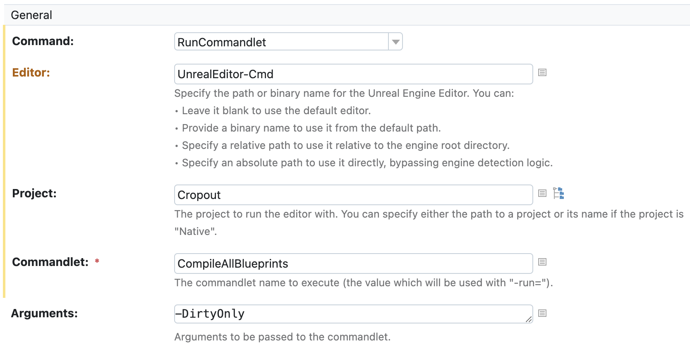
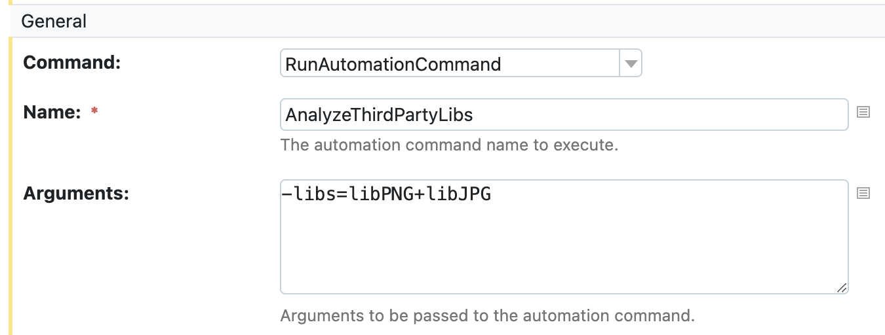

## Plugin Usage

This document provides an elementary description of the plugin and an overview of its capabilities. It assumes that
the plugin is already [installed](README.md#installation) on your TeamCity instance.

### Table of Contents

* [Engine installation detection](#engine-installation-detection)
* [Commandlets](#commandlets)
* [Automation Commands](#automation-commands)
* [Build Graph](#build-graph)
* [UGS integration](#ugs-integration)
* [Limitations](#limitations)
* [Resources](#resources)

### Engine installation detection

The plugin looks for the following files and directories on build agent machines to detect existing Unreal Engine
installations (both installed from the Epic Games Launcher and built from the source code):

* The `LauncherInstalled.dat` file. Typically located at:
    * Windows — `{ProgramData}\Epic\UnrealEngineLauncher\​`
    * MacOS — `{home}/Library/Application Support/Epic/UnrealEngineLauncher/`
    * Linux — `{home}/.config/Epic/UnrealEngineLauncher/`
* The `Install.ini` file. Typically located at:
    * Linux — `{home}/.config/Epic/UnrealEngine/`
    * MacOS — `{home}/Library/Application Support/Epic/UnrealEngine/`
* The `SOFTWARE\Epic Games\Unreal Engine\Builds` registry key (Windows)

Once an engine is detected, its identifier and path are written to corresponding agent properties.
TeamCity utilizes these properties to match compatible agents with build configurations that manage UE solutions.

### Commandlets

Unreal Engine supports creating mini-programs for automation called commandlets. The default Unreal Engine setup includes several built-in commandlets, such as:

* `UCookCommandlet`
* `UCompileAllBlueprintsCommandlet`
* and so on.

You can also develop custom commandlets by extending the `UCommandlet` class. This plugin natively supports launching commandlets.
For example, to compile all blueprints in a [native][unreal-engine.native-project] project named "Cropout" using the Unreal Editor's command-line version:



The equivalent Kotlin DSL configuration:

```kotlin
unrealEngine {
    ...
    command = runCommandlet {
        editorExecutable = "UnrealEditor-Cmd"
        project = "Cropout"
        commandlet = "CompileAllBlueprints"
        arguments = "-DirtyOnly"
    }
    ...
}
```

### Automation Commands

Unreal Engine provides several tools for scripting unattended processes related to the build workflow.
One of these tools is UAT (Unreal Automation Tool), which can be used for a variety of tasks,
including building, cooking, and running games, executing automation tests, and scripting other useful operations.

Typically, using UAT requires creating a separate .csproj file and implementing a specialized `BuildCommand` class,
which can then be executed with the RunUAT script.
However, this plugin simplifies the process by offering several
common commands through a runner interface (available via UI or Kotlin DSL).
The interface allows you to tweak parameters, and the resulting command is automatically generated for you.

#### Predefined Commands

The plugin includes the following predefined commands:
* `BuildCookRun`
* `BuildGraph` (distributed mode is a bit trickier, though - check the corresponding section below)

#### Custom Automation Commands

You can also execute any custom automation command using the runner’s `RunAutomationCommand` option.
For guidance on creating custom automation commands,
refer to the [official documentation][unreal-engine.custom-automation-command].

#### Example

In the following example, we run a built-in Unreal Engine command called `AnalyzeThirdPartyLibs`.



The corresponding Kotlin DSL configuration looks like this:

```kotlin
unrealEngine {
    ...
    command = runAutomationCommand {
        name = "AnalyzeThirdPartyLibs"
        arguments = "-libs=libPNG+libJPG"
    }
    additionalArguments = "-buildmachine -unattended -noP4"
    ...
}
```

### Build Graph

The plugin supports two build graph execution models:
* Single machine
* Distributed

When in distributed mode, your build will be split across all of the available agents based on the description in your
[BuildGraph XML file][unreal-engine.build-graph-script-elements]: every agent will become a separate build configuration, and each node will become a build step.

Currently, there are a few settings that you should be aware of:
* Agent types are converted into the agent requirements, and you're free to mark your agents however you like.

  For example, suppose your agent definition in the build graph XML looks like this
    ``` xml
    <Agent Name="Do something dope" Type="Foo;Bar">
        ...
    <Agent>
    ```

  So, in order to make an agent eligible to run this build you should mark it via declaring [custom agent
  configuration parameter][teamcity.agent.configuration] with the name `unreal-engine.build-graph.agent.type`.
  It might look like this
    ```properties
    unreal-engine.build-graph.agent.type = Foo
    ```
  or you could list as many types as you want like this
    ```properties
    unreal-engine.build-graph.agent.type = Foo;Bar;Baz
    ```
  As long as the agent has at least one matching type it will be eligible to run the build.
* When distributing a build it usually makes sense to set up a proper shared storage. Currently,
  you have to specify network share in the similar fashion via declaring another agent property with the name
  `unreal-engine.build-graph.agent.shared-dir` for each of the agents participating in a build process.

#### How does that work?

As mentioned earlier, when in distributed mode, the build graph will be converted from one representation
(Epic's JSON file, generated by running the BuildGraph command with the -Export parameter) to another (TeamCity's build chain).
Snapshot dependencies within the chain will be configured based on how you set them up between nodes in the graph.
It's worth mentioning that the resulting build configurations will include all the dependencies of their respective nodes.

It's better to demonstrate with an example. Suppose we have the following part of the BuildGraph description (unimportant details are omitted):
```xml
<Agent Name="Work A">
    <Node Name="Step A.1">
        ...
    </Node>
    <Node Name="Step A.2">
        ...
    </Node>
</Agent>
<Agent Name="Work B">
    <Node Name="Step B.1" Requires="Step A.1">
        ...
    </Node>
</Agent>
```
This will result in 2 build configurations:
* Work A
    * Step A.1
    * Step A.2
* Work B
    * Step B.1

The build configuration "Work B" will depend on a build configuration "Work A" despite the fact it might already have been
run after completing step "Step A.1". This is due to the nature of snapshot dependencies and the limitation in TeamCity
where triggering another build after completing a build step is impossible. Keep that in mind when writing your scripts.

###### Artifacts

To produce artifacts from within an Agent/Node, you can use a TeamCity service message along with the built-in
BuildGraph logging task:
```xml
<Option Name="WorkingDir" Restrict=".+" DefaultValue="None" Description="Working directory for the build" />

<Agent Name="Agent" Type="...">
    <Node Name="Produce Artifacts">
        <Spawn Exe="mkdir" Arguments="-p $(WorkingDir)/artifacts/"/>
        <Spawn Exe="touch" Arguments="$(WorkingDir)/artifacts/foo.txt"/>
        <Spawn Exe="echo" Arguments="Content > ./artifacts/foo.txt"/>
        <Log Message="##teamcity[publishArtifacts './artifacts/foo.txt']" />
    </Node>
</Agent>
```
Note: In the script above, we demonstrate one way to reference a working directory from
within a BuildGraph script - by setting an option to the value of one of TeamCity’s [predefined build parameters][teamcity.predefined-build-parameters]:

```kotlin
object Artifacts : BuildType({
    ...
    steps {
        unrealEngine {
            command = buildGraph {
                options = """
                    WorkingDir=%teamcity.build.workingDir%
                """.trimIndent()
            }
        }
    }
    ...
})
```
This variable will be resolved at runtime based on the agent where the build is executed.

### UGS integration

The integration allows you to notify the UGS (Unreal Game Sync) metadata server about the result of a build using badges.
As the build progresses, the plugin will post the corresponding information to the metadata server,
from which UGS will eventually retrieve it. For more detailed information about UGS,
please refer to the official [documentation][unreal-engine.ugs].

One thing to keep in mind: currently, the endpoints provided by the UGS metadata server are not secured with authorization.
Presumably, it's supposed to run within a closed network.

The integration is implemented in two forms:
* As an extension to the [Commit Status Publisher][teamcity.commit-status-publisher].
* As a feature for the "distributed" BuildGraph run mode.

#### Commit Status Publisher

The behavior is similar to other publishers: you need to select the corresponding one and fill out the required parameters.


You can also configure it from Kotlin DSL:

```kotlin
commitStatusPublisher {
    publisher = ugsMetadataServer {
        serverUrl = "http://localhost:3000"
        badge = "Foo Badge"
        project = "//foo/bar/project"
    }
}
```

#### Build Graph

To enable support within a BuildGraph build, you should run it in “distributed” mode and configure
the settings as follows:

```kotlin
unrealEngine {
    command = buildGraph {
        // irrelevant settings are omitted
        executionMode = distributed {
            badges = enableBadges {
                metadataServer = "http://localhost:3000"
            }
        }
    }
}
```
Alternatively, you can configure it in the UI:


In this case all the badges defined in the script will be published according to the dependent nodes they are linked to.

As an example of the script:
```xml
<BuildGraph >
    ...
    <Agent Name="Build A" Type="A">
        <Node Name="Node A.1">
            ...
        </Node>
        <Node Name="Node A.2">
            ...
        </Node>
    </Agent>

    <Agent Name="Build B" Type="B">
        <Node Name="Node B.1">
            ...
        </Node>
        <Node Name="Node B.2">
            ...
        </Node>
    </Agent>

    <Badge Name="Foo Badge" Project="//foo/bar/project" Requires="Node A.2;Node B.1"/>
    ...
</BuildGraph>
```

Here, the badge "Foo Badge" tracks the execution of two nodes: "Node A.2" and "Node B.1".
As soon as one of them starts executing, the badge will update its status. If one of them fails, the status will
change to "Failure". The badge will only show "Success" when all dependencies complete successfully.

### Limitations

* Although TeamCity still supports Java 8, this plugin is compatible with Java 11 or newer.
* Currently, for the distributed BuildGraph mode to work,
  your build configuration must contain exactly one active build step.
  This should be addressed in [TW-89015](https://youtrack.jetbrains.com/issue/TW-89015)
* Currently, the plugin does not manage the retention period of the produced artifacts in the shared storage in any way.
It’s your responsibility to set it up properly.

### Resources

If you'd like to learn more about the plugin, check out these blog posts:

* [Introducing the Unreal Engine Plugin for TeamCity](https://blog.jetbrains.com/teamcity/2024/05/unreal-engine-plugin-for-teamcity/)
* [Updates on Unreal Engine Support in TeamCity: UGS Integration and Open-Sourcing the Plugin](https://blog.jetbrains.com/teamcity/2024/11/unreal-engine-plugin-ugs-integration-and-open-sourcing/)

[teamcity.agent.configuration]: https://www.jetbrains.com/help/teamcity/configure-agent-installation.html
[teamcity.commit-status-publisher]: https://www.jetbrains.com/help/teamcity/commit-status-publisher.html
[teamcity.predefined-build-parameters]: https://www.jetbrains.com/help/teamcity/predefined-build-parameters.html
[unreal-engine.build-graph-script-elements]: https://dev.epicgames.com/documentation/en-us/unreal-engine/buildgraph-script-elements-reference-for-unreal-engine
[unreal-engine.ugs]: https://dev.epicgames.com/documentation/en-us/unreal-engine/unreal-game-sync-reference-guide-for-unreal-engine
[unreal-engine.native-project]: https://dev.epicgames.com/community/learning/knowledge-base/eP9R/unreal-engine-what-s-a-native-project
[unreal-engine.custom-automation-command]: https://dev.epicgames.com/documentation/en-us/unreal-engine/create-an-automation-project-in-unreal-engine
